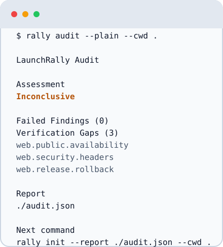

# LaunchRally

**Know what stands between your repository and a trustworthy launch.**

[](https://www.npmjs.com/package/@launchrally/cli)
[](https://github.com/codeacme17/launchrally/actions/workflows/ci.yml)
[](LICENSE)
[](https://nodejs.org/)

LaunchRally is a local-first, open-source launch-readiness audit and verification tool for repository-owning AI builders. It turns repository facts, declared launch intent, and explicitly approved read-only evidence into a deterministic assessment and an ordered path to verification.

It needs no LaunchRally account, uses no default telemetry, and makes no repository, deployment, or Provider write during an Audit.

> **Status: Experimental P0.** P0 is Product Complete and `0.2.1` is publicly available on the non-stable `experimental` channel. Telemetry-Free Validation is collecting aggregate directional signals; LaunchRally is not P0 Validated, and authority-expanding P1 implementation remains blocked.

## First Audit

Run the exact public Experimental CLI without a global installation:

```bash
npm exec --package=@launchrally/cli@0.2.1 -- rally audit --json --cwd .
```

LaunchRally is local-first: the Audit examines supported repository metadata through a boundary-checked Local Safe Scan, requests launch intent when it cannot be established safely, and returns a versioned interaction before any optional public or Provider read. It requires no LaunchRally account and the Audit performs no repository writes.

If npm needs to download the package, review and accept its normal package-manager confirmation. LaunchRally does not bypass that prompt, recommend a global install, or use a pipe-to-shell installer. Public verification and each Provider read remain separate, explicit permission decisions; denying one creates a visible Verification Gap instead of silently weakening the assessment.

The completed Audit produces an immutable JSON Report Record, a Markdown Report View, and a separately versioned Evidence Index in CLI output. The assessment is `Launch Ready`, `Ready with Warnings`, `No Go`, or `Inconclusive`, depending on policy and the evidence actually collected. Nothing is adopted into the project unless you later save the Report, run `rally init`, inspect its exact preview, and confirm that separate change.

The terminal below uses deterministic synthetic fixture output. Your result will reflect your repository, confirmed scope, evidence, and permission choices.

<picture>
  <source media="(prefers-color-scheme: dark)" srcset="docs/assets/launchrally-terminal-dark.svg">
  
</picture>

Continue with the [Quickstart](docs/getting-started/quickstart.md) for the complete interaction flow and safe ways to save the result.

## How it works

1. **Audit** — scan local facts, confirm scope, approve optional reads, and produce a deterministic assessment. See the [Quickstart](docs/getting-started/quickstart.md).
2. **Plan or remediate** — initialize project-owned history only after preview, then turn confirmed Findings into ordered work. See the [Manifest, Report, and Evidence model](docs/concepts/data-model.md).
3. **Verify** — recollect evidence after remediation and create a new immutable result without silently changing project intent. See the [permission and privacy boundaries](docs/concepts/privacy.md).

## What it checks and produces

| Area | What LaunchRally does |
| --- | --- |
| Repository and release intent | Discovers supported local facts, then asks you to confirm inferred scope. |
| Web launch baseline | Evaluates security, reliability, operability, and release-readiness Checks against versioned policy. |
| Public and Provider evidence | Performs only the bounded, read-only operations you approve; missing evidence stays visible. |
| Audit output | Returns a JSON Report Record, Markdown Report View, Evidence Index, Findings, and Verification Gaps. |
| Follow-up work | Produces a deterministic Launch Plan and fresh full or targeted verification results. |

The [Coverage Acceptance Matrix](docs/reference/coverage-acceptance.md) contains runnable JavaScript, non-JavaScript, split, multi-app, and custom representatives. It demonstrates the universal Baseline journey, not a framework or Provider support allowlist.

## Safety and permissions

- No LaunchRally account, private service, default telemetry, or mandatory Report upload.
- Audit performs no repository writes; `init` is preview-first and requires a separate confirmation.
- Local scan, public verification, and every Provider read are distinct authorization boundaries.
- Environment values, credentials, raw package scripts, and uncontrolled Provider fields are not retained.
- LaunchRally never installs Provider tools, initiates login, provisions infrastructure, deploys, stages, or commits changes.

Read the complete [privacy and permission model](docs/concepts/privacy.md) and [data model](docs/concepts/data-model.md) before using LaunchRally with sensitive repositories.

## Commands and integrations

| Command or integration | Purpose | Guide |
| --- | --- | --- |
| `rally audit` | Assess confirmed launch scope from local and approved read-only evidence. | [Quickstart](docs/getting-started/quickstart.md) |
| `rally init` | Preview and confirm isolated `.launchrally` project adoption. | [Initialization](skills/launchrally/references/init.md) |
| `rally plan` | Turn current Findings into ordered, read-only remediation guidance. | [Planning](skills/launchrally/references/plan.md) |
| `rally providers` | Compare advisory Provider Decision Cards after confirming constraints. | [Provider guidance](skills/launchrally/references/plan.md) |
| `rally verify` | Recollect evidence and record a fresh full or targeted result. | [Verification](skills/launchrally/references/verify.md) |
| Codex and Claude | Install, update, remove, and validate the Agent adapters. | [Install and release guide](docs/getting-started/install.md) |

## Packages

| Package | Audience and purpose |
| --- | --- |
| [`@launchrally/cli`](packages/cli/README.md) | Builders running the first Audit and the complete command journey. |
| [`@launchrally/core`](packages/core/README.md) | Library authors embedding deterministic audit and verification logic. |
| [`@launchrally/contracts`](packages/contracts/README.md) | Integrators consuming versioned schemas, constants, and protocol contracts. |
| [`@launchrally/codex-plugin`](adapters/codex/launchrally/README.md) | Codex users installing the canonical LaunchRally Agent Skill adapter. |
| [`@launchrally/claude-plugin`](adapters/claude/launchrally/README.md) | Claude Code users installing the canonical LaunchRally Agent Skill adapter. |

## Documentation and project links

- [Documentation index](docs/README.md)
- [Quickstart](docs/getting-started/quickstart.md)
- [Install and release guide](docs/getting-started/install.md)
- [Project status and Telemetry-Free Validation](docs/maintainers/phase-0-validation.md)
- [Contributing](CONTRIBUTING.md)
- [Security](SECURITY.md)
- [GitHub Discussions](https://github.com/codeacme17/launchrally/discussions)
- [GitHub Issues](https://github.com/codeacme17/launchrally/issues)
- [Apache-2.0 license](LICENSE)
